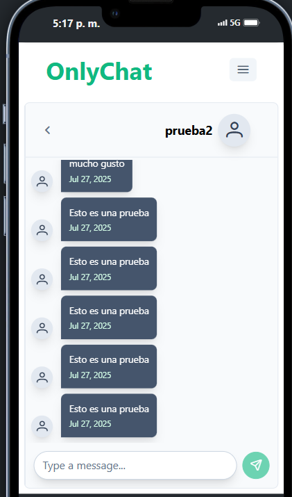

# 🚀 OnlyChat – Chat Personal en Tiempo Real

**OnlyChat** es una plataforma de mensajería personal que permite a los usuarios registrarse, autenticarse y comunicarse en tiempo real a través de una interfaz moderna y responsiva.

---

## 📦 Características

- **Chat en tiempo real** con WebSocket + STOMP  
- **Autenticación y autorización** segura mediante JWT  
- Gestión de usuarios y roles (registro, login, permisos)  
- Persistencia de mensajes en **PostgreSQL**  
- Notificaciones de mensajes nuevos y leídos  
- API RESTful
- Envío de correos para confirmación de cuenta y recuperación de contraseña  
- Interfaz responsiva compatible con móviles y escritorio

---

## 📷 Capturas de Pantalla

 
 
 
 
 
 
 
 
 
 

    
  

 

---

## 🛠 Tecnologías

| Capa          | Tecnologías                                        |
| ------------- | --------------------------------------------------- |
| **Frontend**  | Angular 19.2.4 · TypeScript · RxJS · Angular CLI    |
| **Backend**   | Java 21 · Spring Boot 3.x · Spring Security (JWT) · Spring Data JPA |
| **Base de datos** | PostgreSQL 12+                                 |

---

## 🔗 Enlaces

- 📂 [Repositorio Frontend](https://github.com/Osweld/onlychat-frontend)  
- 📂 [Repositorio Backend](https://github.com/Osweld/onlychat-backend)  

